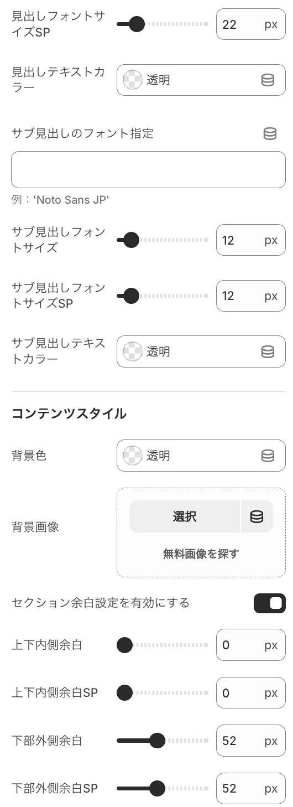

# Shopify Tabbed List

---

Shopify で **コンテンツの一覧表示 + タブ切替** を簡単に実装できるセクションです。  
- タブをクリックすると、関連・類似するコンテンツを切り替えて表示可能  
- Liquid + CSS + JavaScript でシンプルに実装  
- メンテナンス性を考慮し、メタオブジェクトや商品メタフィールドの更新だけで動作 

---

## 🚀 使用方法

1. `sections/blog-list-slide.liquid` をテーマに追加  
2. ブログ内の分類を使用し、カテゴリー作成
3. テーマエディタでセクションを追加し、セクション設定を行う
4. セクション内に、ブロズを関連づけする

---

## 💻 完成ビューサンプル

- 完成プレビューサンプルです。

- タブ切り替え時のプレビューサンプルです。

---

## 🧩 セクションの構成サンプル
- 親セクション

- 子セクション

---

### 📋 ブログ内の分類サンプル

---

## 🧑‍💻 作者

**Ryohma U.**  
ポートフォリオ：[https://www.rnsystem.jp](https://www.rnsystem.jp)

---

> 💡 **補足**  
> このコードは教育・学習目的で公開しています。  
> 実運用時は必ずテーマ構成やメタオブジェクト名を各店舗環境に合わせて変更してください。
